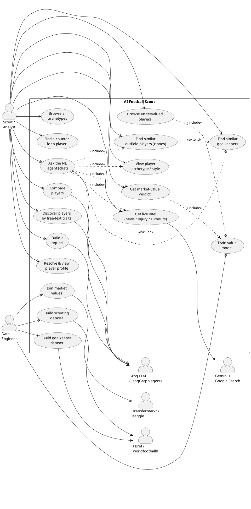
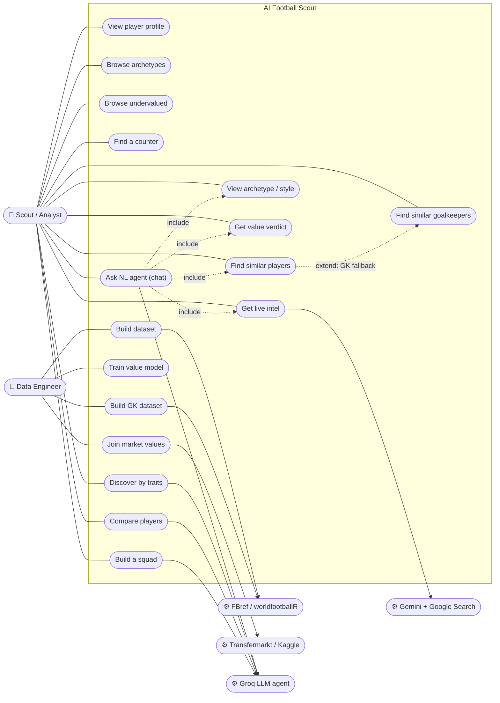

# AI Football Scout — Use Case Diagram

This document models **all user interactions** with the AI Football Scout system.
It separates **human actors** (who initiate goals) from **external system actors**
(third-party services the system depends on to fulfil those goals).

## Actors

| Actor | Type | Role |
|-------|------|------|
| **Scout / Analyst** | Human (primary) | End user — finds clones, archetypes, value verdicts, intel via the React UI or API |
| **Data Engineer** | Human (primary) | Builds datasets, joins market values, trains the value model (runs the `pipeline/` scripts) |
| **FBref / worldfootballR** | External system | Source of the raw Big-5 per-90 / style CSVs |
| **Transfermarkt / Kaggle** | External system | Source of player market values (label for the value model) |
| **Groq LLM (LangGraph agent)** | External system | Powers the natural-language `/chat`, `/discover`, `/compare`, `/squad` features |
| **Gemini + Google Search** | External system | Grounded live news / injury / discipline / rumour intel |

---

## PlantUML (standard UML use-case notation)

> Render at <https://www.plantuml.com/plantuml> or with the PlantUML VS Code extension.

---

## Mermaid (quick-preview alternative)

> GitHub / most markdown previewers render this without any tooling.

---

## Reading notes

- **`<<include>>`** — the chat agent always *routes into* one of the core
  capabilities (clone / archetype / value / intel) once it parses intent.
- **`<<extend>>`** — the outfield clone finder *optionally* falls back to the
  goalkeeper engine when the queried name isn't an outfield player.
- **External system actors** appear on the right: the system can't fulfil the
  NL, intel, or data-build use cases without them.
- The four **Data Engineer** use cases are offline pipeline steps
  (`pipeline/01..05`, `04_train_value_model.py`); the value-serving routes
  return `503` until `Train value model` has been run.
